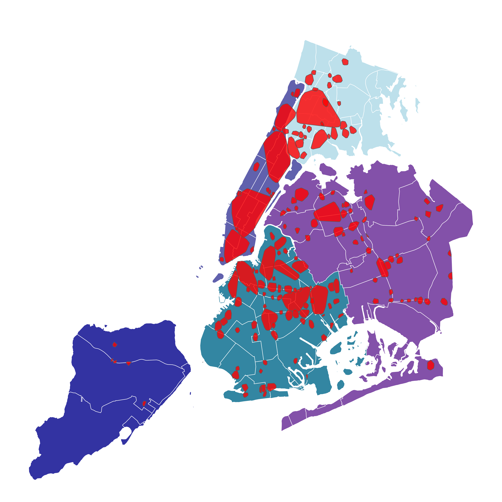

## Abstract

The following is an analysis of the contributing factors to New York City vehicular collision based harm (death or physical injury). Analysis utilizes DBScan to identify locations within N.Y.C. that have a high density of harmful collisions. Additionally, VIP and SHAP values from a weighted response XGBoost classifier provides clarity on important contributing factors to if a collision will result in harm.



## Introduction

This analysis aims to identity and understand key contributing events/behaviors that cause individuals to be harmed in vehicular collisions. Harm will be defined in this analysis as an individual being physically injured or killed as the result of a collision. We will be utilizing open source, data on vehicular collisions that occur within the boroughs of N.Y.C. city. In addition to modeling, we will also be utilizing unsupervised, density based clustering algorithms to find the most problematic areas/areas of the greatest harm caused by vehicular collision.

The overarching goals of this study and analysis is to identify problematic areas where the city of New York could improve or make safer conditions for drivers, and to find which transportation based factors result in a higher chance of harm. Finding these factors can allow us to improve upon them or education individuals on safer transportation habits - creating a safer environment for the City of New York.

### Data

[N.Y.C. Open Data](https://opendata.cityofnewyork.us/){target="_blank"} is a repository for open source data pertaining to the events and going-ons in New York City. New York City offices, agencies, and partners all publish open data on various categories that concern the happenings of the city.

The Motor Vehicle Collisions data tables contain information from all police reported motor vehicle collisions in N.Y.C. A police report is required to be filled out for collisions where someone is injured or killed, or where there is at least \$1000 worth of damage occurs. The tables are updated daily and contain data that goes back to April 16th. The overall data set consists of three primary tables...

-   **Crashes:** contains details on individual crash events. Each row represents a singular crash event. We will also be using this table to create our density based clusters.

-   **Vehicles:** contains details on each vehicle involved in an individual crash. Each row represents a singular motor vehicle involved in a crash.

-   **Persons:** contains details for people involved in a specific crash. Each row represents a singular person (driver, occupant, pedestrian, bicyclist,..) involved in a crash. This table is where a majority of our data will come from.

These datasets are accessible either directly from N.Y.C. Open Data's website as downloadable csv files, or via json through N.Y.C.'s API.

For more information about N.Y.C. Open Data and/or these specific data tables, one can visit N.Y.C. Open Data [here](https://opendata.cityofnewyork.us/){target="_blank"}.

### How to Get the Data Yourself & Replicate the Analysis

To replicate this analysis, one can download the individual tables ([Crashes](https://data.cityofnewyork.us/Public-Safety/Motor-Vehicle-Collisions-Crashes/h9gi-nx95/about_data){target="_blank"}, [Vehicles](https://data.cityofnewyork.us/Public-Safety/Motor-Vehicle-Collisions-Vehicles/bm4k-52h4/about_data){target="_blank"}, [Persons](https://data.cityofnewyork.us/Public-Safety/Motor-Vehicle-Collisions-Person/f55k-p6yu/about_data){target="_blank"}) from N.Y.C. and follow all of the data cleaning steps listed bellow.

Alternatively, I have also created an accessible, cleaned final dataframe that would allow an individual to skip the data cleaning steps if wanted.

Here is a [.csv version](https://drive.google.com/file/d/1rI42nlDSPBbO2DQXsaTNPn58PSZDt_7_/view?usp=drive_link){target="_blank"} and a [.rds version](https://drive.google.com/file/d/1DgS-RiCcFVjoEHd70UozkKnD-Xdigd_W/view?usp=drive_link){target="_blank"} of the cleaned dataframe. I suggest using the .rds version as a .rds file preserves R based variables and dataframe characteristics (i.e. factors and factor orderings). This means that all of the encoding and work done in the cleaning bellow is retained upon loading the .rds file.

In addition, here is a [link to the collision tables term sheet](https://data.cityofnewyork.us/api/views/bm4k-52h4/files/c1023d71-3dba-430d-890c-a00cd2015bfe?download=true&filename=MVCollisionsDataDictionary_20210917_ERD.xlsx){target="_blank"}, which contains useful information about individual features and how to join the tables together.

## Data Cleaning and Engineering

### Libraries Used

```{r}
#| echo: false
#| output: false


library(tidyverse)
library(janitor)
library(lubridate)
library(rnaturalearth)
library(sf)
library(ggthemes)
library(maps)
library(mapdata)
library(ggmap)
library(nycgeo)
library(scales)
library(dbscan)
```

To perform the necessary data cleaning and engineering, we will be primarily be leveraging **Tidyverse** and Tidyverse adjacent packages like **Lubridate**. We will also be using **DBScan** and various mapping packages to create clusters based on the density and severity of car crashes.

### Tables

N.Y.C. open data provides three main tables pertaining to vehicular collisions.

-   **Crashes:** contains details on individual crash events. Each row represents a singular crash event. We will also be using this table to create our density based clusters.

-   **Vehicles:** contains details on each vehicle involved in an individual crash. Each row represents a singular motor vehicle involved in a crash.

-   **Persons:** contains details for people involved in a specific crash. Each row represents a singular person (driver, occupant, pedestrian, bicyclist,..) involved in a crash. This table is where a majority of our data will come from.

What follows is a walk through of the methodology used to clean and construct the final dataframe used for modeling. The following section about the **Crashes** table also pertains to how density based clusters were constructed to identify high frequency areas of dangerous collisions.

#### Crashes

```{r}
CRASHES_raw <- read.csv("data/Motor_Vehicle_Collisions_-_Crashes_20250402.csv") %>% clean_names()
```

The code chunk bellow does the following:

-   Removes any observations that have missing coordinate information (this is necessary for our clustering)

-   Fills any value that is a blank, with a R native NA value

-   Creates a combined datetime features by combining the individual date and time features

-   Filters the dataset to contain only crashes for the year of 2024, and from the first of January to the 29th of March of 2025

-   Converts all character typed features into factor typed features

-   Drops the unneeded location feature

```{r}
CRASHES <- CRASHES_raw %>%
  drop_na(latitude) %>%
  drop_na(longitude) %>%
  filter(latitude != 0,
         longitude != 0) %>%
  mutate(across(everything(), ~ifelse(.== "", NA, .))) %>%
  unite("crash_datetime", crash_date, crash_time, sep = " ", remove = TRUE) %>%
  mutate(crash_datetime = (mdy_hm(crash_datetime))) %>%
  filter(year(crash_datetime) > 2023) %>%
  filter(crash_datetime <= "2025-03-30") %>%
  mutate_if(is.character, as.factor) %>%
  select(-c(location))
```

##### Clusters

We will utilize **DBScan** (Density-Based Spatial Clustering of Applications with Noise) to identify areas within New York City that have a high frequency of vehicular collisions. There are motivations for doing so are (1) to find areas within the city that could be improved by the city (fixing roads, improving traffic control, etc), and (2) using the information we gain from clustering as a means to embed location into our classification model. Geocoded information is often difficult to encode into a model; however, if the clusters we create could be potential predictors for our classification problem.

###### Unweighted

We will first being with creating plain, unweighted density based clusters. To do so, we will extract the longitude & latitude for each observation and use them as our primary measures for the clustering algorithm. Note that we do not scale or standardize these measures. Typically when clustering we would standardize the measures in order to get them on the same scale such that one measure doesn't "override" another. However, if one standardizes longitude & latitude then certain parameters within the DBScan algorithm lose their interpretability.

Particularity, we will be utilizing an epsilon of 0.0025 and a minimum number of points of 70. For longitude & latitude, an epsilon of 0.0025 should equate to roughly 1/3 of a mile, while the minimum number of points refers to how many collisions must occur for a cluster to even begin to form.

Also take note that points on the cluster border points of will be added to bordering clusters instead of being counted as noise.

```{r}
DBDATA <- CRASHES %>%
  select(longitude, latitude)
```

```{r}
set.seed(42)
db_clust <- dbscan::dbscan(x = DBDATA, eps = 0.0025, minPts = 70,
                           borderPoints = TRUE)
```

```{r}
CRASHES$clust <- as.factor(db_clust$cluster)
```

###### Map of Clusters

Using the [nycgeo](https://nycgeo.mattherman.info/){target="blank"} package we are able to create a map of N.Y.C. with our clusters overlaid as SF polygonal objects.

```{r}
nyc_cd <- nyc_boundaries(
  geography = 'cd',
) %>% 
  st_transform(2263)
```

Note that in order for the polygons to form the individual coordinates did have to be jittered slightly due to overlapping crashes. This does not have any effect on our clustering assignments, it is solely done for the visualization of the clusters.

```{r}
set.seed(54)

clust_map <- CRASHES %>%
  mutate(longitude = jitter(longitude, 0.00001)) %>%
  st_as_sf(coords = c("longitude", "latitude"), crs = 4326) %>%
  st_transform(crs = 2263)
```

```{r}
cluster_poly <- clust_map %>%
  filter(clust != 0) %>%
  group_by(clust) %>%
  summarise() %>%
  st_cast("POLYGON") %>%
  st_convex_hull()
```

```{r}
map1 <- ggplot() +
  geom_sf(data = nyc_cd,
    color = "white",
    lwd = 0.2,
    aes(fill = borough_name),
    alpha = 0.8) +
  geom_sf(
    data = cluster_poly,
    alpha = 0.8,
    fill = ("red")) +
  scale_fill_manual(values = c("lightblue", "deepskyblue4",
                               muted("blue"),
                               muted("purple"), "darkblue"),
                               guide = guide_legend(override.aes = list(
                                 linetype = "blank",
                                 shape = NA
                               ))) +
  labs(color = "",
       fill = "Borough", 
       title = "N.Y.C. with High Density Areas of Vehicular Collision") +
  theme_void() +
  theme(plot.title.position = 'plot',
        legend.position = "none",
        plot.title = element_text(hjust = 0.5),
        panel.grid = element_line(color = "transparent"),
        panel.background = element_rect(fill = "white", color = "white"))

map1
```

From the map above we can see that we were able to identity clusters within every borough of N.Y.C. However, some clusters span very large areas - particularity the clusters in Manhattan. Therefore, we are going to try another approach to make the clusters more granular.

###### Weighted

In order to reduce the size of the clusters we are going to weight the individual data points. Each data point will now receive a weight equivalent to how many individuals were harmed (killed or injured) by that particular crash. Note that crashes where no one was harmed will receive a weight of 0.5.

Other than weighting the clusters, everything else remains the same.

```{r}
CRASHES <- CRASHES %>%
  mutate(injuries_deaths = number_of_persons_injured + number_of_persons_killed) %>%
  mutate(case_when(injuries_deaths == 0 ~ 0.5))
```

```{r}
set.seed(42)
db_clust <- dbscan::dbscan(x = DBDATA, eps = 0.0025, minPts = 70,
                             borderPoints = TRUE, weights = CRASHES$injuries_deaths)
```

```{r}
CRASHES$clust_weighted <- as.factor(db_clust$cluster)
```

###### Map of Weighted Clusters

```{r}
set.seed(54)

clust_map <- CRASHES %>%
  mutate(longitude = jitter(longitude, 0.00001)) %>%
  st_as_sf(coords = c("longitude", "latitude"), crs = 4326) %>%
  st_transform(crs = 2263)

cluster_poly <- clust_map %>%
  filter(clust_weighted != 0) %>%
  group_by(clust_weighted) %>%
  summarise() %>%
  st_cast("POLYGON") %>%
  st_convex_hull()
```

```{r}
map2 <- ggplot() +
  geom_sf(data = nyc_cd,
    color = "white",
    lwd = 0.2,
    aes(fill = borough_name),
    alpha = 0.8) +
  geom_sf(
    data = cluster_poly,
    alpha = 0.8,
    fill = ("red")) +
  scale_fill_manual(values = c("lightblue", "deepskyblue4",
                               muted("blue"),
                               muted("purple"), "darkblue"),
                               guide = guide_legend(override.aes = list(
                                 linetype = "blank",
                                 shape = NA
                               ))) +
  labs(color = "",
       fill = "Borough", 
       title = "N.Y.C. with High Density Areas of Vehicular Collision",
       subtitle = "Weighted by Total Number of Injuries Occured") +
  theme_void() +
  theme(plot.title.position = 'plot',
        legend.position = "none",
        plot.subtitle = element_text(hjust = 0.5),
        plot.title = element_text(hjust = 0.5),
        panel.grid = element_line(color = "transparent"))

map2
```

As seen in the map above, weighting the data points reduces the number of clusters produced and their relative size. However, because of the weights, these clusters instead represent dense areas of severe or harmful crashes. Since these clusters are more granular, and we are interested in predicting if harm falls upon an individual involved in a collision, we will utilize these weighted clusters while modeling.

#### Vehicles

```{r}
VEHICLES_raw <- read.csv("data/Motor_Vehicle_Collisions_-_Vehicles_20250401.csv") %>% clean_names()
```

The code chunk bellow does the following:

-   Fills any value that is a blank, with a R native NA value

-   Creates a combined datetime features by combining the individual date and time features

-   Filters the dataset to contain only crashes for the year of 2024, and from the first of January to the 29th of March of 2025

-   Converts all character typed features into factor typed features

```{r}
VEHICLES <- VEHICLES_raw %>%
  mutate(across(everything(), ~ifelse(.== "", NA, .))) %>%
  unite("crash_datetime", crash_date, crash_time, sep = " ", remove = TRUE) %>%
  mutate(crash_datetime = (mdy_hm(crash_datetime))) %>%
  filter(year(crash_datetime) > 2023) %>%
  filter(crash_datetime <= "2025-03-30") %>%
  mutate_if(is.character, as.factor)
```

#### Persons

```{r}
PERSONS_raw <- read.csv("data/Motor_Vehicle_Collisions_-_Person_20250401.csv") %>% clean_names()
```

The code chunk bellow does the following:

-   Fills any value that is a blank, with a R native NA value

-   Creates a combined datetime features by combining the individual date and time features

-   Filters the dataset to contain only crashes for the year of 2024, and from the first of January to the 29th of March of 2025

-   Converts all character typed features into factor typed features

```{r}
PERSONS <- PERSONS_raw %>%
  mutate(across(everything(), ~ifelse(.== "", NA, .))) %>%
  unite("crash_datetime", crash_date, crash_time, sep = " ", remove = TRUE) %>%
  mutate(crash_datetime = (mdy_hm(crash_datetime))) %>%
  filter(year(crash_datetime) > 2023) %>%
  filter(crash_datetime <= "2025-03-30") %>%
  mutate_if(is.character, as.factor)
```

##### Cleaning Person's Table

Further cleaning on the Person's table is needed, such as...

-   Removing individuals who are impossibly old or young (kept only values between 0 and 105)

-   Removing any "Registrant" from our data. These are individuals who registered a collision with the police and are not actually involved in the collision itself. If an individual was both a "Registrant" and an active participant of the collision, they were recorded twice in the table as both; hence, why removing all "Registrant" observations was pertinent

-   Removed any observation which did not contain the necessary foreign keys need for joins (vehicle_id and collision_id)

-   Implemented a final check that every individual in the data was in-fact unique

```{r}
PERSONS <- PERSONS %>%
  filter(person_age <= 105,
         person_age >= 0) %>%
  filter(ped_role != "Registrant") %>%
  filter(!is.na(vehicle_id),
         !is.na(collision_id)) %>%
  distinct(unique_id, .keep_all = TRUE)
```

##### Handling Missing Values in Persons Table

The following chunk of code imputes a common or unknown nominal value into missing values within the nominal features of the **Persons** table.

```{r}
DATA <- PERSONS %>%
  #mutate_if(is.factor, as.character) %>%
  mutate(
         vehicle_id = ifelse(is.na(vehicle_id), "No Vehicle", vehicle_id),
         ejection = case_when(is.na(ejection) ~ "Not Ejected",
                                .default = ejection),
         position_in_vehicle = case_when(is.na(position_in_vehicle) ~ "Not in Vehicle",
                                .default = position_in_vehicle),
         safety_equipment = case_when(is.na(safety_equipment) ~ "Unknown",
                                .default = safety_equipment),
         ped_location = case_when(is.na(ped_location) ~ "Unknown",
                                .default = ped_location),
         ped_action = case_when(is.na(ped_action) ~ "Unknown",
                                .default = ped_action)
         )
```

### Making Primary Dataset

#### Joining

Now that all tables are clear of any detrimental observations, and the features are mostly cleaned, we can go about joining them into one main table.

We will join both the **Vehicles** and **Crashes** tables onto the **Persons** table by using the foreign keys in each table (vehicle_id and collision_id).

Also note that the vehicle_occupants feature was updated to always be at least 1.

```{r}
DATA <- PERSONS %>%
  left_join(VEHICLES, by = c("vehicle_id" = "unique_id")) %>%
  left_join(CRASHES, by = c("collision_id.x" = "collision_id"), keep = TRUE) %>%
  filter(vehicle_occupants < 90) %>%
  mutate(vehicle_occupants = case_when(vehicle_occupants == 0 ~ 1,
                                       .default = vehicle_occupants))
```

#### Extracting Desired Features

Next we extracted only the wanted features from the new primary table. Note that any observation without a recorded weighted cluster was also dropped.

```{r}
DATA <- DATA %>%
  select(unique_id, crash_datetime.x, person_type, person_age, 
         position_in_vehicle, safety_equipment,
         ped_role, person_sex,
         person_injury, state_registration, vehicle_type,
         vehicle_year, vehicle_occupants, driver_sex,
         driver_license_status, pre_crash,
         point_of_impact, contributing_factor_vehicle_1,
         clust_weighted) %>%
  filter(!is.na(clust_weighted)) # crashes with no geocoded information
```

#### Handling Categorical Features

This data set contains primarily nominal/categorical features. As such, the levels of some features had to be lumped or augmented in order to be ready for modeling.

##### Vehicle Type

Naturally, the vehicle type variable has 733 different nominal/categorical values. This is far to many to actually model with, thus they have to be lumped together. The various categorical values often repeat (but are spelled differently) or comparable to one another in some way (e.g. a bike is comparable in categorical value to an E-bike). Thus, we are able to collapse the feature into 12 categorical values: van, bus, sedan, suv, truck, misc, municipal, medical, personal, taxi, and other for categories with very low membership.

```{r}
DATA <- DATA %>%
  mutate(vehicle_type = fct_collapse(vehicle_type,
                                     van = c("10 Paaseng", "Amazon del", "Amazon van", "Van", "van",
                                             "Refrigerated Van", "School van"),
                                     bus = c("Bus", "School Bus", "SCHOOL BUS", "subn", "charter bu",
                                             "School bus", "MTA BUS", "bus"),
                                     sedan = c("2 dr sedan", "4dsd", "4", "4door", "Sedan", "Convertible",
                                               "3-Door", "4 dr sedan"),
                                     suv = c("ACCESS A R", "Access-A-R", "PK",
                                             "Station Wagon/Sport Utility Vehicle"),
                                     truck = c("Trailer", "TRUCK", "AMAZON TRU", "Amazon tru", "Apportione",
                                               "AMSGC", "ARMORED TR", "Armored Truck", "Beverage Truck",
                                               "Pick-up Truck", "Box Truck", "Tractor Truck Diesel",
                                               "Flat Bed", "Tow Truck / Wrecker", "Tractor Truck Gasoline",
                                               "Flat Rack", "Tanker", "Armored Truck", "TRAILER",
                                               "TOW TRUCK", "Beverage Truck", "Pallet",
                                               "BOX TRUCK", "Bulk Agriculture", "Pick up", "F550",
                                               "PICK UP", "Truck", "Box truck", "DELIVERY T"),
                                     misc = c("?Y? 06", "0", "0000", "000", "09", "2", "263", "5", "a",
                                              "LIMO", "Multi-Wheeled Vehicle", "FORKLIFT", "Open Body",
                                              "Commercial", "COMMERCIAL", "Motorized Home", "FORK LIFT", "Forklift"),
                                     motorBike = c("3 Wheel Ve", "Moped", "Motorcycle", "Motorbike",
                                                   "Stake or Rack", "Lift Boom", "moped"),
                                     municipal = c("FDNY FIRE", "Fire truck", "Fire Truck", "ATTECHMENT",
                                                   "BACKHOE", "Dump", "Garbage or Refuse", "Concrete Mixer",
                                                   "FIRETRUCK", "FIRE TRUCK", "Snow Plow", "FDNY",
                                                   "Fire Truck", "SANITATION", "FDNY FIRET", "Sanitation",
                                                   "DEPARTMENT", "DUMP TRUCK", "FIRE", "GARBAGE TR",
                                                   "CITY OF NE", "FDNYLadder", "FDNY TRUCK", "Fire engin",
                                                   "FIRE TRUCK"),
                                     medical = c("amb","Amb", "AMB", "ambu", "Ambu", "AMBU", "ambulance",
                                                 "Ambulance", "AMBULANCE", "Ambulances", "AMBULANE", "ambulette", 
                                                 "AMBULETTE", "FDNY AMBUL", "AMBU", "AMB", "FDNY EMS",
                                                 "ambulance"),
                                     personal = c("Bike", "E-Bike", "E-Scooter", "Carry All", "Motorscooter",
                                                  "MOPED", "Pedicab", "SCOOTER", "Minibike", "Minicycle",
                                                  "Scooter"),
                                     taxi = c("Taxi", "Chassis Cab", "taxi"),
                                     other_level = "Other"
                                     ))
```

##### Lumping State Licence Registration as Binary Variable

The `state_registration_NY` contained 63 unique categorical values (which is more than the number of states which exist in the U.S.). Thus, the variable was converted to a binary classification: 1 if the driver had a NY state registration and 0 otherwise.

```{r}
DATA <- DATA %>%
  mutate(state_registration_NY = (
    case_when(state_registration == "NY" ~ 1,
              .default = 0))) %>%
  select(-c(state_registration))
```

##### Making Clusters a Binary Variable

The weighted cluster variable contained 97 different cluster values. This is far to many to effectively model for, thus the variable was converted to a binary classification: 1 if the collision occurred within one of the weighted clusters and 0 otherwise.

```{r}
DATA <- DATA %>%
  mutate(clust_weighted_IN = (
    case_when(clust_weighted != 0 ~ 1,
              .default = 0)
  )) %>%
  select(-c(clust_weighted))
```

##### Creating Response Variable

Lastly, we will create our response feature for modeling. We will consider an individual who was physically injured or killed during a collision as an individual who was "Harmed," and we will maintain the datasets native alternative class, "Unspecified," for those who were not "Harmed."

```{r}
DATA <- DATA %>%
  mutate(person_injury = as.factor(
    case_when(person_injury == "Injured" ~ "Harmed",
              person_injury == "Killed" ~ "Harmed",
              .default = "Unspecified"))) %>%
  relocate(person_injury, .after = clust_weighted_IN)
```

#### Saving Final Dataframe

I will be saving the final data table as a .rds file primary to keep a clean copy in case any future modeling results in crashes, causing the data to be wiped. Furthermore, downloading it as a .rds and not a .csv preserves R based variables and dataframe characteristics (i.e. factors and factor orderings). This means that all of the encoding and work we did above is retained upon loading the .rds file.

To get access to this cleaned .rds file, and/or a clean .csv version, see the instruction and links in the **How to Get the Data Yourself & Replicate the Analysis** section above.

```{r}
saveRDS(DATA, file = "data/DATA.rds")
```

## Clean Up

During cleaning and exploratory analysis we produced/loaded tables and graphs that are not needed for the rest of the analysis. Thus, in order to keep our workspace clear and enable faster run times, we will clear any extra elements we don't want from our active environment

```{r}
rm(list = ls()) # wipes active environment

gc() # cleans up any "hidden" tasks or data files
```

## Modeling

Now that our data cleaning and engineering is complete, we can move on to modeling/predicting if an individual was harmed in a given vehicular collision.

### Libraries Used

For modeling we will primarily be utilizing **Tidymodels** and other **Tidyverse** adjacent packages to create our model workflows. Packages such as caret and xgboost contain our models and methods to evaluate them, while parallel and future allows us to train our models in parallel - significantly decreasing overall modeling run time.

```{r}
#| echo: false
#| output: false


library(tidyverse)
library(tidymodels) # for model workflows
library(xgboost)
library(vip)
library(finetune)
library(parallel)
library(SHAPforxgboost)
library(embed)
library(caret)
library(kableExtra)
library(themis)
library(future)
library(kableExtra)
```

### Loading Primary Data Frame

As noted above, we wiped our active environment after data cleaning and engineering; however, we saved our main, cleaned data table locally as a .rds.

```{r}
DATA <- readRDS("data/DATA.rds")
```

#### Budgeting Data

In order to prevent overfitting and effectively tune our future models, we are going to budget our final data table. Particularly, we will utilize a 75%/25% training/testing split, with our response variable `person_injury` as a declared stratification. Declaring our strata to be the response variable preserves the response's class balance while sampling. Furthermore, we will utilize the newly made training set to form two sets of cross validated folds (both stratified using the `person_injury` response). One set of five cross-validated training folds will be used to test multiple models and their performance, while a set with 10 cross-validated folds will be used to tune/race the hyperparameters of our final model.

```{r}
set.seed(42) # setting random state

# budgeting
DATA_split <- initial_split(DATA, strata = person_injury)

DATA_train <- training(DATA_split)

DATA_test <- testing(DATA_split)

DATA_folds_10 <- vfold_cv(DATA_train, strata = person_injury)

DATA_folds_5 <- vfold_cv(DATA_train, strata = person_injury, v = 5)
```

### Feature Engineering

We have already preformed the majority of our feature engineering above in the **Data Cleaning and Engineering** section. However, there is still steps that need to be taken to make our data interpenetrate to our models. The following code chunk contains a chain of **Tidymodels** functions which perform important transformations and encoding to our data. I will explain each line bellow the code chunk.

```{r}
rec_models <-
  recipe(person_injury ~., data = DATA) %>%
  update_role(unique_id, new_role = "ID") %>%
  step_time(crash_datetime.x, features = c("hour")) %>%
  step_date(crash_datetime.x, features = c("dow"),
            keep_original_cols = FALSE) %>%
  step_impute_median(all_numeric_predictors()) %>%
  step_lencode_glm(contributing_factor_vehicle_1, outcome = vars(person_injury)) %>%
  step_unknown(all_nominal_predictors()) %>%
  step_dummy(all_nominal_predictors(), one_hot = TRUE) %>%
  step_nzv(all_predictors())
```

-   **recipe:** this is establishing our modeling statement for all models that utilize this "recipe." The statement `person_injury ~.` translates to "predict the response `person_injury` using all available explanatory variables in the data provided data."
-   **update_role:** changes the `unique_id` to a true ID variable. This means that it will effectively be ignored by model that utilizes this data recipe.
-   **step_time:** uses our date-time encoded feature `crash_datetime.x` to create a numeric, hour variable. This variable is coded as an integer using the 24 hour clock time (railway/military time).\
-   **step_date:** uses our date-time encoded feature `crash_datetime.x` to create a nominal day-of-the-week feature. Since this new feature is nominal, any future steps that effect nominal features will also effect this one. Also not the `keep_original_cols = FALSE` within the function call. As we will not be using the `crash_datetime.x` feature to create any more future features, we can remove it from the dataframe.
-   **step_impute_median:** imputes all missing values of numeric features with their median value.
-   **step_lencode_glm:** creates a supervised generalized linear model to encode the `contributing_factor_vehicle_1` feature as log-likelihoods. Since the feature his a high cardinality, other nominal encoding methods (like dummy or one-hot) would be inefficient. Thus, treating individual levels of the feature as likelihoods effectively converts the nominal feature into a numeric one.\
-   **step_unknown:** imputes all missing or unknown values of nominal features with an "unknown" value.
-   **step_dummy:** encodes all nominal features as one-hot, binary variables.
-   **step_nzv:** removes all predictors that are "near-zero variance." Due to the high cardinality of our dataset some features are highly spare and/or extremely unbalanced (creating features with near-zero variance). This features are essentially "red-herrings" that our models will investigate, but ultimately learn nothing from. Thus, this step removes them from our recipe all together.

```{r}
preped <- prep(rec_models)

preped
```

From the prepped recipe output, one can see that all preprocessing steps were trained/completed. Therefore we can carry forward with modeling.

### Exploring Multiple Models

To determine "the best model for the job," we will be evaluating three different models in their ability to correctly predict if someone was harmed in a vehicular collision.

#### Defining Models

Specifically we will be using the following models:

-   a Random Forest, with 256 trees, built with the ranger engine. We will be tuning both the mtry and min_n parameters.
-   an eXtreme Gradient Boosted classification tree, with 1000 trees, built with the XGBoost engine. We again will be tuning for both the mtry and min_n parameters.
-   a logistic regression built with the glmnet engine. We will be tuning for both the penalty and mixture parameters, essentially creating an elastic net logistic regression.

```{r}
rf_spec_tune <- rand_forest(trees = 256,
                       mtry = tune(),
                       min_n = tune()) %>%
  set_engine("ranger") %>%
  set_mode("classification")

xG_spec_tune <-  boost_tree(trees = 1e3,
                       min_n = tune(),
                       mtry = tune(),
                       learn_rate = 0.01) %>%
  set_engine("xgboost") %>%
  set_mode("classification")

logReg_spec_tune <- logistic_reg(penalty = tune(),
                                 mixture = tune()) %>%
  set_engine("glmnet") %>%
  set_mode("classification")
```

#### Defining Workflow

We will combine together our model specifications and data recipe within a workflow set. This provides the training and tuning functions of **Tidymodels** the necessary instructions to preform model training.

```{r}
models <-
  workflow_set(
    preproc = list(rec = rec_models),
    models = list(
      logReg_tune = logReg_spec_tune,
      xG_tune = xG_spec_tune,
      rf_tune = rf_spec_tune
      ),
    cross = TRUE
  )
```

```{r}
models
```

As one can see from the output above, we will be only testing three models. It is possible to create more model permutations by adding more data recipes and/or model specifications; however, we are only going to stick to the three.

#### Running & Mapping Models

We will now take our model workflow and run each model through a tuning regimen. Specifically, for each model, we will be preforming an ANOVA race across five cross-validated training folds, with a hyperparameter grid size of 10.

In other words, we will be creating ten versions of each model, each with varying values for their hyperparameters. These models will be trained on the cross-validated training folds, producing performance metrics after each data fold. If any models' performance metrics are significantly lower (deemed through an ANOVA test) than the other models, it is kicked out of the race. This process continues until all cross-validated folds are trained/tested on, or only one model remains after a particular fold (it is possible for models to "tie" if they both make it to the final fifth data fold). In practice, winning models have stronger set hyperparameters which allow models to be more accurate than an untuned version.

During the race, we will be comparing models' pr_auc and roc_auc. These are both metrics that measures a model's performance; however, pr_auc is a stronger pick for when nominal responses have imbalanced classes. Since our response is imbalanced, we will be using pr_auc as our tuning metric.

Note that I am using the **future** package to create 10 parallel sessions of R to train multiple models in parallel with on another. This substantially increases over all tuning run time. If one is replicating this code on their own system, changing the number of workers/parallel sessions of R will effect how fast this particular chunk of code runs.

```{r}
startTime <- Sys.time()

set.seed(52)

future::plan(multisession, workers = 10)

work_map <- models %>%
    workflow_map(
        "tune_race_anova",
        grid = 10,
        resamples = DATA_folds_5,
        metrics = metric_set(pr_auc, roc_auc),
        verbose = TRUE
    )

endTime <- Sys.time()
```

```{r}
runTime <- endTime - startTime

runTime
```

#### Evaluating Models

Post tuning, we are able to extract the winning models from each race (note that the boost tree race had a "tie" and produced two winners).

```{r}
#| fig-align: center

autoplot(work_map)
```

From the race results, it appears the the logistic regression model had the highest pr_auc. However, it has an extremely poor roc_auc of 0.5 (which essentially means that the model is as good as flipping a coin). Due to these extreme measures, we will extract the model from the workflow, and then train and test it to see if it is really the "best" model.

```{r}
rank_results(work_map, rank_metric = "pr_auc")
```

```{r}
log_regModel <- work_map %>%
  extract_workflow("rec_logReg_tune") %>%
  finalize_workflow(select_best(work_map %>% extract_workflow_set_result("rec_logReg_tune"),
                                metric = "pr_auc"))
```

```{r}
best_fit <- log_regModel %>%
  last_fit(DATA_split)
```

```{r}
DATA_pred_val <- collect_predictions(best_fit)$.pred_class

model <- extract_workflow(best_fit)

DATA_act <- DATA_test$person_injury

cm <- confusionMatrix(DATA_pred_val, DATA_act)

cm
```

Above is a confusion matrix of the "winning" logistic regression model. Despite having an overall accuracy 0.7371, we can see that is model is not a very effective one. Particularly because of fact that all it did was "predict" Unspecified 100% of the time. This kind of result is not completely unexpected to the the class imbalance seen within the response variable.

### Making Final Model

The issues found with class imbalance does mean that we are going to have to use more sophisticated modeling techniques. If we wanted an "accurate" model we could just stick with the logistic regression; however, we want to be able to predict if someone was harmed within a vehicle collision. We need to not only achieve model accuracy, but also model sensitivity.

#### Defining Model & Handling Class Imbalance

In order to handle class imbalances, we are going to utilize the XGBoost engine to create a gradient boosted classification tree. The reason we are using XGBoost is due its `scale_pos_weight` parameter. This parameter allows us to scale the weight of the positive classifier (in our case the "Harmed" condition), which can make the more or less sensitive to the positive value. As a rule of thumb, a good weight is normally the ratio between the number of negative values and postive values in the model's training set. In our case that would look like...

$$
scale\_pos\_weight = number\ of\ Unspecified\ \ \div\ number\ of\ Harmed\
$$

For our training set this ratio works out to be roughly 2.80, so we will round up to 3 for the model.

For our final model, we will utilizing a similar XGBoost specification as the one used in our model comparison. The only differences is the newly added `scale_pos_weight` parameter and that we will now be also tuning the number of trees within our model.

```{r}
xgb_spec <-
  boost_tree(
    trees = tune(),
    min_n = tune(),
    mtry = tune(),
    learn_rate = 0.01
  ) %>%
  set_engine("xgboost", scale_pos_weight = 3) %>%
  set_mode("classification")
```

As we are only tuning one model, we now only need the singular workflow instead of the workflow set.

```{r}
xgb_workflow <- 
  workflow(rec_models, xgb_spec)
```

#### Updating Parameters & Creating Tuning Grid

In order to make a better preforming model, we will be utilizing a more robust method for creating our hyperparameter grid. In particular we will be using a space filling grid method that tries to create cover as much space as possible, while still maintaining some uniformity. This method essentially casts a wide net across the hyperparemter space in an attempt to hopefully find the "best" permutation of hyperparameters.

This methodology is also sometimes refereed to as max-entropy grids or Latin hyper cubes.

```{r}
params <- xgb_workflow %>% 
  parameters() %>%
  update(mtry = mtry(c(10, 47)))
```

```{r}
modelGrid <- grid_space_filling(params, size = 20)
```

Since this is the final model, we will be using a larger grid size (twenty permutations) than the one used in the initial model comparisons.

#### Racing Models

Alike the tuning for the the model comparison workflow, we will also be using an ANOVA race to tune our XGBoost. The only differences is the inclusion of the space filling grid, and we will be utilizing 10 cross-validated folds instead of 5. This will not only make the race longer, creating more time for a winner to separate from the pack, but it will also help prevent from overfitting as each fold will be now be smaller.

```{r}
startTime2 <- Sys.time()

set.seed(52)

future::plan(multisession, workers = 10)

xgb_race <- tune_race_anova(
  xgb_workflow,
  resamples = DATA_folds_10,
  grid = modelGrid,
  metrics = metric_set(pr_auc, sens),
  control = control_race(verbose_elim = TRUE)
)


endTime2 <- Sys.time()
```

```{r}
runTime2 <- endTime2 - startTime2

runTime2
```

The model race produced one clear winner, whose performance split from the rest of the pack after the fourth cross-validated fold.

```{r}
#| fig-align: center

race <- plot_race(xgb_race) 

race +
  labs(title = "Model Race (ANOVA)") +
  theme_minimal() +
  theme(plot.title = (element_text(hjust = 0.5)))
```

#### Fitting & Evaluating Final Model

Now that we have found a "winning" set of model hyperparameters, we can extract our winner from the model workflow and evaluate it on the entire data set.

```{r}
xgb_last <- xgb_workflow %>%
  finalize_workflow(select_best(xgb_race, metric = "pr_auc")) %>%
  last_fit(DATA_split)
```

```{r}
DATA_pred_val <- collect_predictions(xgb_last)$.pred_class

model <- extract_workflow(xgb_last)

DATA_act <- DATA_test$person_injury

cm <- confusionMatrix(DATA_pred_val, DATA_act)

cm
```

Our final model has substantially better performance than the logistic regression "winner" in our model comparison work set. We were able to achieve a similar overall accuracy to the logistic regression model, but were able to achieve a much higher sensitivity (ability to correctly predict the "harmed" condition) of nearly 70%. Weighting the positive class was extremely effective in leveling out our model's performance and improving its ability to correctly predict the positive class instance.

### Understanding Model Results

As we were able to produce a model with desirable performance, we are able to derive information from its decision making process which could help us better understand what causes or contributes to injuries in vehicular collisions.

#### VIP

A **V**ariable **I**mportance **P**lot can provide us with an aggregate, global view of feature importance within our model. The importance is calculated by looking at feature gain, i.e. how much error a particular feature reduces. The more error a feature reduces, it more important it becomes to the model.

```{r}
#| fig-align: center

importance_graph <- extract_workflow(xgb_last) %>%
  extract_fit_parsnip() %>%
  vip(geom = "col", num_features = 10, mapping = aes(fill = Variable))

importance_graph +
  labs(title = "Top Ten Important Variables for Pass/Fail") +
  theme_minimal() +
  theme(plot.title = element_text(hjust = 0.5), legend.position = "none")
```

We will be taking a look at the top five features to see if we are able to understand how they contribute to harm caused during vehicular collisions.

#### Vehicle Type

Basic visualization of the vehicle type feature paints a clear picture of how it contributes to the harm classification. Specifically, individuals riding a personal vehicle (scooter, skate board, bicycle, etc.) or motor bike during a vehicular collision are much more likely to be harmed.

Of the automotive vehicles, it appears that taxis and sedans passengers are at the most risk to be harmed during collision, while larger vehicles like trucks, ambulances, and municipal vehicles are the least likely.

```{r}
#| fig-align: center

DATA %>%
  left_join(
    DATA %>% 
      group_by(vehicle_type, person_injury) %>%
      summarise(n = n()) %>%
      pivot_wider(names_from = person_injury, values_from = n) %>%
      mutate(harmProportion = Harmed / (Harmed + Unspecified)) %>%
      select(vehicle_type, harmProportion)
    ) %>%
  mutate(vehicle_type = fct_reorder(vehicle_type, harmProportion)) %>% 
  mutate(person_injury = fct_rev(person_injury)) %>% 
  ggplot(aes(x = vehicle_type, fill = person_injury)) +
  geom_bar(position = "fill", alpha = 0.8) +
  labs(title = "Proportion of Individuals Harmed in Collision by Vehicle Type",
       x = "Vehicle Type",
       y = "Proportion",
       fill = "Injury") +
  scale_fill_brewer(palette = "Dark2") +
  theme_minimal() + 
  theme(plot.title = element_text(hjust = 0.5),
        axis.text.x = element_text(vjust = 0.8, angle = 45),
        legend.position = "top")
```

#### Contributing Factor

The contributing factor feature was also extremely important the our model's decision making process. This feature, due to its high cardinality, was encoded as a numeric variable using the log-likelihoods from a supervised GLM.

In order to understand how the individual levels of the original nominal feature contributes to the model, we will need to extract the GLM and likelihood loadings from our recipe.

```{r}
glmEncoding <- preped %>%
  tidy(number = 4)
```

Graphical visualization of the log-likelihood loadings clearly shows that two of the levels are associated with greater risk of being harmed in a collision. Conversely, the the last four features are actually associated with greater chances of note being harmed in a collision.

```{r}
#| fig-align: center

glmEncoding %>%
  mutate(level = as.factor(level)) %>%
  mutate(level = fct_reorder(level, value)) %>%
  arrange(-value) %>%
  ggplot(aes(x = level, y = value)) +
  geom_col(fill = "red", alpha = 0.6) +
  labs(x = "Contributing Factor",
       y = "Log-Likelihood",
       title = "Likelihood Encoding of Contributing Factor Variable") +
  coord_flip() +
  theme_minimal() + 
  theme(legend.position = "none") + theme(axis.text.y = element_text(size = 5))
```

To take a closer look at the actual log-odds and odds, we can look at a table of the GLM loadings.

```{r}
#| fig-align: center

glmEncoding %>%
  select(level, value) %>%
  mutate("Odds" = (exp(value))) %>%
  mutate(value = (value)) %>%
  arrange(-value) %>%
  rename("Contributing Factor" = level,
         "log Odds" = value) %>%
  kable(caption = "GLM Encoding of Contributing Factor",
        digits = 3) %>%
  kable_styling()
```

Intuitively, loss of consciousness or complications with prescription medication as a contributing factor to collision puts and individual at the greatest risk of being harmed during a collision. Furthermore, accidents causes by defective tow hitches, use of navigation devices, backing up, or passing another vehicle too closely are less likely to result in an individual being harmed.

#### Pre-Crash Behavior

The model specifically identified the "going straight ahead" pre-crash behavior important to the model. This makes since as that particular behavior has the highest chance of producing an injury form collision. This makes intuitive since as head on vehicular collisions are going to most likely going be the most violent.

```{r}
#| fig-align: center

DATA %>%
  left_join(
    DATA %>% 
      group_by(pre_crash, person_injury) %>%
      summarise(n = n()) %>%
      pivot_wider(names_from = person_injury, values_from = n) %>%
      mutate(harmProportion = Harmed / (Harmed + Unspecified)) %>%
      select(pre_crash, harmProportion)
    ) %>%
  mutate(pre_crash = fct_reorder(pre_crash, harmProportion)) %>% 
  mutate(person_injury = fct_rev(person_injury)) %>% 
  ggplot(aes(x = pre_crash, fill = person_injury)) +
  geom_bar(position = "fill", alpha = 0.8) +
  labs(title = "Proportion of Individuals Harmed in Collision by Pre-Crash Activity",
       subtitle = "",
       x = "Pre-Crash Activity",
       y = "Proportion",
       fill = "Collision Based Injury") +
  coord_flip() +
  scale_fill_brewer(palette = "Dark2") +
  theme_minimal() + 
  theme(plot.title = element_text(hjust = 0.5),
        legend.position = "top") + theme(legend.position = "right")
```

#### Vehicle Occupants & SHAP Values

Vehicle occupants is one of the few, true numeric features within our dataset. However, traditional and basic data visualizations do not clearly reveal how the model is using this feature. Note that it is difficult to identify a clear difference in the boxplots bellow.

```{r}
#| fig-align: center

DATA %>%
  ggplot(aes(x = vehicle_occupants, y = person_injury, fill = person_injury)) +
  geom_boxplot() +
  labs(x = "Vehicle Occupants",
       y = "Personal Injury",
       title = "Personal Injury by Number of Vehicle Occupants") +
  scale_fill_brewer(palette = "Dark2") +
  theme_minimal() +
  theme(legend.position = "none",
        plot.title = element_text(hjust = 0.5),
        plot.subtitle = element_text(hjust = 0.5))
```

Due to the failure of traditional visualization techniques, we are forced to use more advanced techniques to understand how the model is using this feature.

We will utilize **SH**aply **A**dditive ex**P**lanations (**SHAP** values) to show the contribution of the occupants feature for each individual observation within our training set. This allows us to construct a plot that to see how the values of the feature effects the prediction of the response (positive SHAP values equate to an increase towards the prediction of the positive class, while negative SHAP values equate to an increase towards the prediction of the negative class).

```{r}
startTimeShap <- Sys.time()

xgb_fit <- extract_fit_engine(xgb_last)

collision_shap <-
  shap.prep(
    xgb_model = xgb_fit,
    X_train = bake(prep(rec_models),
      has_role("predictor"),
      new_data = NULL,
      composition = "matrix")
  )

endTimeShap <- Sys.time()
```

```{r}
SHAPRunTime <- endTimeShap - startTimeShap

SHAPRunTime
```

```{r}
occupants_shap <- shap.plot.dependence(
  collision_shap,
  x = "vehicle_occupants",
  size0 = 1.2,
  smooth = FALSE, 
  add_hist = FALSE
)
```

```{r}
p1 <- occupants_shap +
  scale_x_continuous(trans=scales::pseudo_log_trans(base = 10))
```

```{r}
#| fig-align: center

ggExtra::ggMarginal(
  p = p1,
  type = 'box',
  margins = 'both',
  size = 5,
  colour = 'black',
  fill = 'gray'
)
```

From the SHAP plot we can see that the number of occupants in a vehicle increases, the model's prediction for harm to occur decreases. Interestingly, the SHAP plot reveals that this feature has very little contribution to the prediction of the positive class as very few values go above zero.

In other words, the model is primarily using this feature to predict the negative class, or that an individual remains unharmed during an accident. A jitter graph, with a log-scaled x-axis, mirror what is occurring in the SHAP value plot.

```{r}
#| fig-align: center

DATA %>%
  ggplot(aes(x = vehicle_occupants, y = person_injury, fill = person_injury)) +
  geom_jitter(aes(color = person_injury),
              height = 0.2, width = 0.3, alpha = 0.1) +
  geom_vline(xintercept = 7, linetype = "longdash") +
  labs(x = "Vehicle Occupants",
       y = "Personal Injury",
       title = "Personal Injury by Number of Vehicle Occupants",
       caption = "log-scale",
       subtitle = "Higher Density of Unspecified Condition after 7+ Vehicle Occupants") +
  scale_x_continuous(trans=scales::pseudo_log_trans(base = 10)) +
  scale_color_brewer(palette = "Dark2") +
  theme_minimal() +
  theme(legend.position = "none",
        plot.title = element_text(hjust = 0.5),
        plot.subtitle = element_text(hjust = 0.5))
```

As one can see in the jitter plot, the harmed and unspecified classes share a similar density of collisions up to an occupancy of 7. Once a vehicle starts having more than 7 individuals riding in it, the density of the harmed class drops substantially in comparison to the unspecified class.

This finding make intuitive since as vehicles with more occupants are typically much larger in size and stature. City buses, and other large public transport vehicles, are less likely to suffer sever damage during collision simply due to their size. It makes since that less damage to the vehicle would also equate to less damage to the occupants.

#### Point of Impact

The model also identified getting hit in the center-back-end of your vehicle to be important in predicting the harm class.

```{r}
#| fig-align: center

DATA %>%
  left_join(
    DATA %>% 
      group_by(point_of_impact, person_injury) %>%
      summarise(n = n()) %>%
      pivot_wider(names_from = person_injury, values_from = n) %>%
      mutate(harmProportion = Harmed / (Harmed + Unspecified)) %>%
      select(point_of_impact, harmProportion)
    ) %>%
  mutate(point_of_impact = fct_reorder(point_of_impact, harmProportion)) %>% 
  mutate(person_injury = fct_rev(person_injury)) %>% 
  ggplot(aes(x = point_of_impact, fill = person_injury)) +
  geom_bar(position = "fill", alpha = 0.8) +
  labs(title = "Proportion of Individuals Harmed in Collision by Point of Impact",
       subtitle = "",
       x = "Point of Impact",
       y = "Proportion",
       fill = "Collision Based Injury") +
  coord_flip() +
  scale_fill_brewer(palette = "Dark2") +
  theme_minimal() + 
  theme(plot.title = element_text(hjust = 0.5),
        legend.position = "top") + theme(legend.position = "right")
```

Interestingly, the center-back-end point of impact does not have the highest proportion of the harmed condition. Rather, the demolished, overturned, and other categories have a higher proportion of "harmed" classifications. It see why this particular level is deemed more important than the others, we can look at a graph that utilizes counts instead of proportions.

```{r}
#| fig-align: center

DATA %>%
  left_join(
    DATA %>% 
      group_by(point_of_impact, person_injury) %>%
      summarise(n = n()) %>%
      pivot_wider(names_from = person_injury, values_from = n) %>%
      mutate(harmProportion = Harmed / (Harmed + Unspecified)) %>%
      select(point_of_impact, harmProportion)
    ) %>%
  mutate(point_of_impact = fct_reorder(point_of_impact, harmProportion)) %>% 
  mutate(person_injury = fct_rev(person_injury)) %>% 
  ggplot(aes(x = point_of_impact, fill = person_injury)) +
  geom_bar(position = "stack", alpha = 0.8) +
  labs(title = "Count of Individuals Harmed in Collision by Point of Impact",
       subtitle = "",
       x = "Point of Impact",
       y = "Count",
       fill = "Collision Based Injury") +
  coord_flip() +
  scale_fill_brewer(palette = "Dark2") +
  theme_minimal() + 
  theme(plot.title = element_text(hjust = 0.5),
        legend.position = "top") + theme(legend.position = "right")
```

Based on the counts, instead of proportions, we can clearly understand why the model choose the center-back-end condition over the others above it. Specifically, the other high harm proportion conditions have little to no observations within the data. Thus, they were most likely removed for model when we were removing near-zero variance features. Therefore, center-back-end contained the highest proportion of the "Harmed" class in the encoded data the model was trained on.

## Conclusions

From our analysis of N.Y.C. vehicular collisions, we were able to identify dense areas of severe or harmful crashes. Although these clusters were found to be of little use during modeling, they could still provide useful in understanding vehicular collisions holistically. Particularly, if cities, such as N.Y.C., analysed areas of dense areas of harmful collisions they may find issues with city infrastructure. There is not enough data within the source to know what may be causing these dense areas; however, future investigation could be done to see if there are correlating factors with the found clusters (road conditions, inefficient infrastructure, etc).

Furthermore, by modeling with a gradient boosted classification tree (with a weighted positive class to account for class imbalance) we were able to able to derive meaningful insight into what increases an individual's risk for being harmed during vehicular collisions.

It was found that collisions involving small, personal vehicles are more likely to end in harm, thus those who use personal vehicles like bikes or E-bikes regularly should try and be more cautious. Furthermore, specific collision conditions are more/less likely to end in harm. Individuals who are under certain prescribed medication and/or have difficulty maintain consciousness are much more likely to be harmed in collisions. Additionally, number of occupants a vehicle contains is correlated to how large a vehicle is which is intuitively linked to how likely one is to be harmed in a vehicle - large the vehicle, lower the chances of being harmed. Lastly, and unsurprisingly, head on collisions are found to be more harmful than other collision impact types.

Future work on this topic should be directed towards finding a way to effectively encode location into modeling. Density based clustering was not found to be useful to the model; however, alternative methods of encoding location could provide useful. Furthermore, there are alternative ways one can handle the class imbalance of the response variable. Particularity, utilizing a nearest neighbor oversampling technique could be used to synthetically create observations of the positive class.
